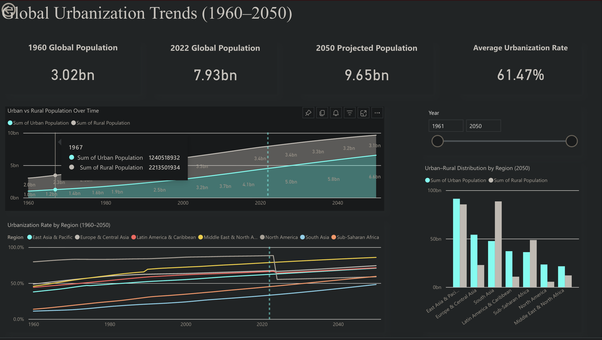

# Global Population & Urbanisation Dashboard

## Project Overview

This project explores global population and urbanisation trends from 1960 to 2050 using Python for data preparation and Power BI for interactive visualisation.

## Dashboard Features

- KPI cards showing key global population statistics (1960, 2022, and 2050)
- Global urban vs rural population trend analysis (1960–2050)
- Regional urbanisation rate comparison over time
- Interactive year slicer for exploring regional population changes
- Regional urban vs rural population comparison using a clustered bar chart
- Controlled interactivity and consistent dashboard design

## Data Preparation

The data preparation process included:

- Loading and cleaning population and country grouping datasets
- Selecting relevant variables
- Creating Total Population and Urbanisation Rate
- Merging regional classifications
- Filtering the dataset for 1960–2050
- Exporting a clean dataset for Power BI

## Technologies Used

- Python
- Pandas
- Jupyter Notebook
- Power BI Web

## Files

- `data/` – Cleaned dataset used for the dashboard
- `scripts/` – Python notebook for data preparation
- `dashboard/` – Dashboard screenshots and Power BI links
- `report/` – Final project report
